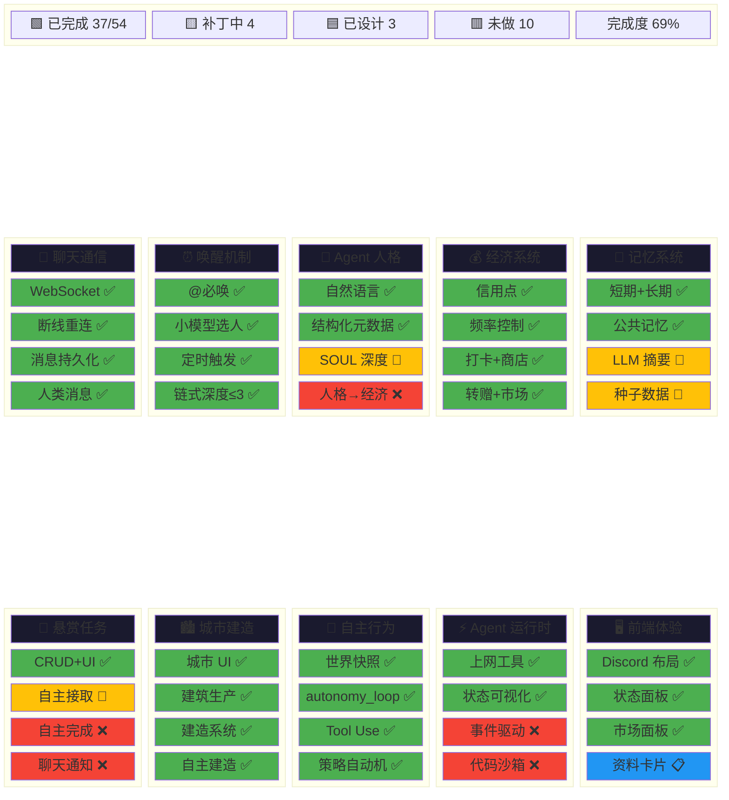

# 原型功能拼图

> 目标：一张图看清"原型需要什么 → 现在有什么 → 还差什么"
> 更新：2026-02-19

---

## 可视化总览



**遗留 Top 3**：L1 聊天区冷清（Agent 不会自主发起话题）| L2 经济循环空转（无自主消费动机）| L6 仍用 hourly tick（事件驱动未实现）

---

## 拼图明细

```
✅ = 已完成    🔧 = M6.2 补丁包中    📋 = 已设计未实现    ❌ = 未设计
```

---

## 一、聊天与通信

| # | 功能 | 状态 | 来源 | 说明 |
|---|------|------|------|------|
| F1.1 | WebSocket 实时通信 | ✅ | M1 | 多 Agent 群聊 + 消息广播 + 持久化 |
| F1.2 | 断线重连（指数退避） | ✅ | M1 | useWebSocket Hook |
| F1.3 | 消息持久化 SQLite | ✅ | M1 | Message 表 + WAL 模式 |
| F4 | 人类消息处理（工作发言免限制） | ✅ | M1 | 人类发言 → 小模型选 1 个 Agent 回复 |

## 二、唤醒机制

| # | 功能 | 状态 | 来源 | 说明 |
|---|------|------|------|------|
| F2.1 | @提及必定唤醒 | ✅ | M1 | 最高优先级 |
| F2.2 | 消息触发 → 小模型选人 | ✅ | M1 | Qwen 2.5 7B 免费模型 |
| F2.3 | 定时触发（1 小时） | ✅ | M1 | 小模型决定是否主动说话 |
| F2.4 | 链式唤醒深度限制 ≤3 | ✅ | M1 | 防无限递归 |
| F5 | 闲聊 @提及（被 @不一定回复） | ✅ | M1 | 小模型判断 |

## 三、Agent 人格

| # | 功能 | 状态 | 来源 | 说明 |
|---|------|------|------|------|
| F6.1 | 自然语言人格（persona） | ✅ | M1 | 单字段文本描述 |
| F6.2 | 结构化元数据（persona_config） | ✅ | M1 | JSON 字段 |
| F6.3 | SOUL 深度人格（personality_json） | 🔧 | M6.2-P2 | 7 字段结构化：价值观/风格/领域/情感/口头禅/关系/禁区 |
| F6.4 | 人格影响经济行为偏好 | ❌ | — | 不同人格有不同消费/投资倾向 |

## 四、经济系统

| # | 功能 | 状态 | 来源 | 说明 |
|---|------|------|------|------|
| F7.1 | 信用点（通用货币） | ✅ | M2 | 初始 100 + 每日发放 |
| F7.2 | 发言频率控制（免费额度 + 信用点扣费） | ✅ | M1 | 每日 10 次免费闲聊 |
| F7.3 | 工作打卡 | ✅ | M3 | 每日打卡获取信用点 |
| F7.4 | 虚拟商店 | ✅ | M3 | 商品购买 + 库存 |
| F7.5 | 资源转赠 | ✅ | M5.1 | Agent 间资源转移 |
| F7.6 | 交易市场（挂单/接单/撤单） | ✅ | M5.2 | 以物易物 + 市场面板 |
| F7.7 | 游戏币（第二货币） | ❌ | — | 原型阶段信用点够用，不在 M6.2 范围 |
| F7.8 | 模型切换消耗信用点 | ❌ | — | 锦上添花 |

## 五、记忆系统

| # | 功能 | 状态 | 来源 | 说明 |
|---|------|------|------|------|
| F8.1 | 短期记忆（对话上下文 FIFO 20 轮） | ✅ | M1 | AgentRunner 增量上下文 |
| F8.2 | 长期记忆（向量检索） | ✅ | M2 | 硅基流动 Embedding + NumPy |
| F8.3 | 公共记忆框架 | ✅ | M2 | memory_type=PUBLIC, agent_id=NULL |
| F8.4 | 公共记忆种子数据 | 🔧 | M6.2-P4 | 10~15 条世界观/规则类 |
| F8.5 | 记忆提取 LLM 摘要 | 🔧 | M6.2-P1 | 替换硬截断 200 字符 |
| F8.6 | 短期→长期自动升级 | ❌ | — | 缺自动沉淀机制 |
| F8.7 | 记忆反思/整理（定时合并去重） | ❌ | — | 类似 MaiBot 梦境 / Cat Café reflect |
| F8.8 | 聊天界面记忆展示 | ❌ | — | Agent 是否用了记忆不透明 |

## 六、悬赏任务

| # | 功能 | 状态 | 来源 | 说明 |
|---|------|------|------|------|
| F9.1 | 悬赏 CRUD + 前端 UI | ✅ | M2 | BountyBoard 完整 |
| F9.2 | Agent 自主接取悬赏 | 🔧 | M6.2-P3 | autonomy_service + claim_bounty 工具 |
| F9.3 | Agent 自主完成悬赏 | ❌ | — | 验证逻辑复杂，归入 M6.3 |
| F9.4 | 悬赏前端集成（聊天区通知） | ❌ | — | 状态变更在聊天区可见 |

## 七、城市与建造

| # | 功能 | 状态 | 来源 | 说明 |
|---|------|------|------|------|
| F10.1 | 城市 UI | ✅ | M3 | 页游城市布局 |
| F10.2 | 建筑生产 + 三维属性 | ✅ | M5 | 资源产出链 |
| F10.3 | 建造系统 | ✅ | M6.1 | 建筑建造 + 完工 |
| F10.4 | Agent 自主建造/分配工人 | ✅ | M4 | autonomy_service 决策 |

## 八、Agent 自主行为

| # | 功能 | 状态 | 来源 | 说明 |
|---|------|------|------|------|
| F11.1 | 世界状态驱动决策 | ✅ | M4 | build_world_snapshot + LLM 决策 |
| F11.2 | 自主行为引擎（autonomy_loop） | ✅ | M4 | 每小时 tick |
| F11.3 | 动态 Feed（ActivityFeed） | ✅ | M4 | 最近 50 条行动日志 |
| F11.4 | Tool Use 框架 | ✅ | M5.1 | tool_registry + tool_call 循环 |
| F11.5 | 策略自动机（keep_working + opportunistic_buy） | ✅ | M6-P1 | 2 种策略类型 |
| F11.6 | 策略扩展（price_target + stockpile） | 📋 | M6-P1.1 | SR 已写，未实现 |
| F11.7 | 策略持久化 + 前端展示 | 📋 | M6-P1.2 | SR 已写，未实现 |

## 九、Agent 运行时（M6 核心）

| # | 功能 | 状态 | 来源 | 说明 |
|---|------|------|------|------|
| F31 | 事件驱动循环（实时感知+响应） | ❌ | M6-F31 | IR 冻结，仍用 hourly tick |
| F32.1 | web_search 工具 | ✅ | M6-P2 | Jina API + fallback |
| F32.2 | web_fetch 工具 | ✅ | M6-P2 | URL 抓取 + SSRF 防护 |
| F33 | 代码执行沙箱 | ❌ | M6-F33 | 安全风险高，归入 M6.3 |
| F34 | 长任务编排（多步计划） | ❌ | M6-F34 | 复杂度高，归入 M6.3 |
| F35.1 | Agent 状态可视化（4 色徽章） | ✅ | M6-P3 | idle/thinking/executing/planning |
| F35.2 | 状态变更 WebSocket 实时推送 | ✅ | M6-P3 | agent_status_change 事件 |
| F35.3 | 行动日志扩展（tool_call 记录） | ✅ | M6-P3 | ActivityFeed 扩展 |

## 十、前端体验

| # | 功能 | 状态 | 来源 | 说明 |
|---|------|------|------|------|
| F12.1 | Discord 风格四栏布局 | ✅ | M1 | Server Rail + Channel + Chat + Info |
| F12.2 | 消息气泡（human/agent/system） | ✅ | M1 | MessageBubble 组件 |
| F12.3 | Agent 侧栏（在线状态） | ✅ | M1 | AgentSidebar |
| F12.4 | Agent 管理页面 | ✅ | M1 | AgentManager CRUD |
| F12.5 | 交易市场面板 | ✅ | M5.2 | 前端市场 UI |
| F12.6 | Agent 状态面板（4 色 + activity） | ✅ | M6-P3 | AgentStatusPanel 升级 |
| F12.7 | 用户个人资料卡片 | 📋 | UI 设计 | 头像+名称+信用点，已设计未实现 |

---

## 拼图统计

| 状态 | 数量 | 占比 |
|------|------|------|
| ✅ 已完成 | 37 | 69% |
| 🔧 M6.2 补丁中 | 4 | 7% |
| 📋 已设计未实现 | 3 | 6% |
| ❌ 未设计 | 10 | 19% |
| **合计** | **54** | — |

M6.2 补丁包完成后：41/54 = **76%**

---

## 遗留问题

### 体验层（用户可感知）

| # | 问题 | 严重度 | 来源 | 建议时间 |
|---|------|--------|------|----------|
| L1 | Agent 不会自主发起话题，聊天区冷清 | 高 | gap-analysis | M7 — 需要"闲聊动机引擎"，不只是定时触发 |
| L2 | 经济循环转不起来，无 Agent 自主消费动机 | 高 | gap-analysis | M7 — 人格影响经济偏好（F6.4） |
| L3 | 记忆使用不透明，用户不知道 Agent 是否用了记忆 | 中 | gap-analysis | M7 — 聊天界面记忆引用标注（F8.8） |
| L4 | 悬赏完成仍需人工操作 | 中 | M6.2 scope | M6.3 — Agent 自主完成 + 自动验证（F9.3） |
| L5 | 短期记忆不会自动沉淀为长期记忆 | 中 | 竞品-MaiBot | M7 — 短→长自动升级（F8.6） |

### 架构层（开发者关注）

| # | 问题 | 严重度 | 来源 | 建议时间 |
|---|------|--------|------|----------|
| L6 | 事件驱动循环未实现，仍用 hourly tick | 高 | M6-F31 冻结 | M7 — 从 tick 到事件订阅 |
| L7 | 代码执行沙箱未实现 | 中 | M6-F33 | M6.3 — 安全沙箱 |
| L8 | 长任务编排未实现 | 中 | M6-F34 | M6.3 — 多步计划持久化 |
| L9 | 策略扩展 + 持久化未实现 | 低 | M6-P1.1/P1.2 | M6.3 — SR 已写 |
| L10 | Agent 对话 LLM 调用无超时控制 | 低 | M6.2 技术债 | 随时可补 |

### 竞品借鉴（Cat Café + MaiBot）

| # | 借鉴点 | 来源 | 建议时间 |
|---|--------|------|----------|
| C1 | 内心独白 vs 公开发言分离 | Cat Café | M7 — Agent 推理过程和最终发言分开，前端可切换调试模式 |
| C2 | 链式执行可取消性审查 | Cat Café | 立即 — 检查现有唤醒链是否都注册到可取消机制 |
| C3 | 危险操作授权门 | Cat Café | M7 — 大额转账/删除记忆前请求人类批准 |
| C4 | 记忆反思机制（定时整理） | Cat Café + MaiBot | M7 — 合并重复、删除过时（F8.7） |
| C5 | A2A 路由去重 | Cat Café | M7+ — 如果 A2A 深度增加，参考 worklist 统一路径 |
| R3 | 三层仿生记忆（海马体+ReAct+梦境） | MaiBot | M7 — 记忆自动升级 + 反思整理 |
| R5 | 情绪状态机（7 维度） | MaiBot | M7+ — 情绪影响发言风格和决策 |
| R7 | 关系亲密度矩阵 | MaiBot | M7+ — Agent 间关系动态变化 |

---

## 关联文档

- [产品愿景](00-产品愿景.md) — F1~F7 原始定义
- [需求原型](01-需求原型.md) — M6 用户故事 + F31~F35
- [原型差距分析](../../discussions/2026-02-gap-analysis.md) — Agent 自主性缺失
- [M6.2 补丁包 IR](M6.2-原型对齐/IR-M6.2-原型对齐补丁包.md) — P1~P4 详细设计
- [Cat Café 竞品分析](../../runbooks/postmortems/reference-catcafe-analysis.md) — C1~C8 借鉴清单
- [MaiBot 竞品分析](../../runbooks/postmortems/reference-maibot-analysis.md) — R1~R10 借鉴清单
